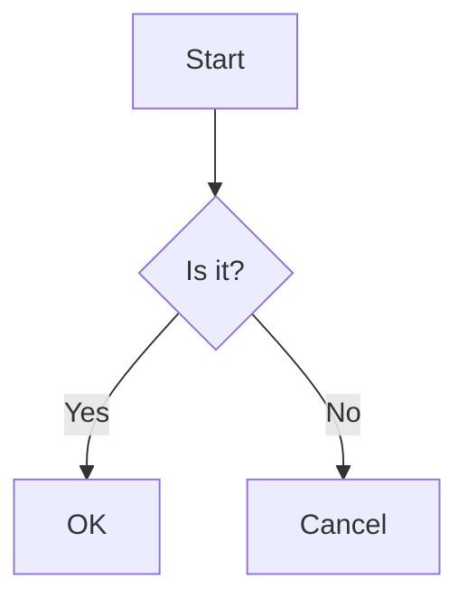

# `@zjlab-frontier/markdown` 使用说明文档

> **包名**：`@zjlab-frontier/markdown`  
> **适用框架**：React（支持 React 16.8+、17.x、18.x）  
> **功能亮点**：支持 **Mermaid 图表**、**LaTeX 数学公式（KaTeX）**、**代码高亮**、**GitHub 风格 Markdown（GFM）**、**自动换行**、**代码复制**、**长代码折叠**、**媒体自动识别** 等。

---

## 📦 安装

```bash
npm install @zjlab-frontier/markdown
```

> ⚠️ 注意：本组件为 **React 组件**，需确保项目中已安装 React（版本 ≥16.8）。

---

## 🚀 快速开始

### 1. 引入组件与样式

```tsx
import ZJMarkdown from '@zjlab-frontier/markdown';
```

### 2. 基本使用

```tsx
function App() {
  const markdownContent = `
# 欢迎使用 ZJLab Markdown

这是一个支持 **Mermaid**、**LaTeX** 和 **代码高亮** 的 React Markdown 组件。

- ✅ 表格
- ✅ 任务列表
- ✅ 数学公式：$E = mc^2$
- ✅ 代码块（带复制按钮）
- ✅ 自动识别音视频链接
  `;

  return <ZJMarkdown content={markdownContent} />;
}
```

---

## 测试组件

用来快速测试、布局、调试的组件，自带全面的 Markdown 测试内容

### 1. 引入组件

```tsx
import { TestZJMarkdown } from '@zjlab-frontier/markdown';
```

### 2. 使用

```tsx
<TestZJMarkdown />
```

---

## 🧩 功能详解

### 1. **GitHub 风格 Markdown（GFM）支持**

通过 `remark-gfm` 插件，完整支持：

- 表格
- 删除线 `~~text~~`
- 任务列表 `- [x] done`
- 自动链接（如 `https://example.com`）

✅ 示例：

```md
| 语法 | 描述 |
|------|------|
| `**bold**` | 加粗 |

- [x] 支持 GFM
- [ ] 其他功能
```

---

### 2. **LaTeX 数学公式（KaTeX）**

支持两种语法：

- 行内公式：`$...$` 或 `\(...\)`
- 块级公式：`$$...$$` 或 `\[...\]`

> ⚠️ 注意：组件内部会自动将 `\(...\)` 和 `\[...\]` 转换为 `$...$` 和 `$$...$$`，确保 KaTeX 正确渲染。

✅ 示例：

```md
爱因斯坦质能方程：$E = mc^2$

高斯积分：
$$
\int_{-\infty}^{\infty} e^{-x^2} dx = \sqrt{\pi}
$$
```

> 📌 **样式说明**：已自动引入 `katex/dist/katex.min.css`，无需手动引入。

---

### 3. **Mermaid 图表渲染**

在代码块中标注语言为 `mermaid` 即可自动渲染图表：

✅ 示例：

````

````

> 🔒 **安全机制**：
> - 若 Mermaid 渲染失败（如语法错误），组件将 **静默失败**（不显示原始代码，避免泄露敏感内容）。
> - 图表容器带有 `no-dark` 类，防止深色主题干扰 Mermaid 默认配色。

> 🖱️ **交互**：点击图表可触发 `viewSvgInNewWindow()`（当前为预留功能，实际未启用弹窗，但保留点击事件扩展点）。

---

### 4. **代码高亮与增强功能**

#### ✅ 支持特性：

- 自动识别语言（基于 `language-xxx` class）
- 显示语言标签（如 “javascript”）
- 一键复制代码（右上角复制按钮）
- 长代码块自动折叠（>400px 高度）
- 纯文本类代码自动换行（如 `text`, `md`, `latex` 等）

#### ✅ 支持自动换行的语言：

```txt
"", "md", "markdown", "text", "txt", "plaintext", "tex", "latex"
```

#### ✅ 复制按钮样式：

- 使用 `.copy-code-button` 类，可通过 CSS 自定义图标。

---

### 5. **媒体自动识别**

组件会自动将特定后缀的链接转换为 `<audio>` 或 `<video>` 元素：

#### 音频格式（自动转为 `<audio controls>`）：
- `.aac`, `.mp3`, `.opus`, `.wav`

#### 视频格式（自动转为 `<video controls>`）：
- `.3gp`, `.3g2`, `.webm`, `.ogv`, `.mpeg`, `.mp4`, `.avi`

✅ 示例：

```md
听一段音乐：https://example.com/song.mp3

看一个视频：https://example.com/demo.mp4
```

---

### 6. **HTML 安全过滤（防 XSS）**

组件对输入内容进行 **双重安全处理**：

1. **转义危险字符**：`<`, `>`, `/`, `=` → 对应 HTML 实体
2. **智能跳过**：
   - 所有代码块（行内 `` `...` `` 和块级 ```...```）
   - LaTeX 公式（`$...$`, `$$...$$`）

> ✅ 保证公式和代码内容不被破坏，同时防止 XSS 攻击。

---

### 7. **文本方向与段落**

- 所有 `<p>` 标签自动添加 `dir="auto"`，支持多语言自动排版。
- 所有换行符（单个 `\n`）自动转为 `<br>`（通过 `remark-breaks`）。

---

## 🎨 自定义样式

### 1. **全局样式类**

组件根元素自动应用：

```html
<div class="markdown-body">...</div>
```

> `.markdown-body` 采用 **GitHub 风格样式**（基于 `github-markdown-css` 理念定制）。

### 2. **自定义字体与字号**

通过 props 控制：

```tsx
<ZJMarkdown
  content={content}
  fontSize={18}          // 默认 16
  fontFamily="'Inter', sans-serif"
/>
```

### 3. **覆盖内置样式**

可通过 CSS 覆盖以下关键类：

| 类名 | 用途 |
|------|------|
| `.markdown-body` | 整体容器 |
| `.mermaid` | Mermaid 图表容器 |
| `.copy-code-button` | 代码复制按钮 |
| `.show-hide-button` | 代码折叠按钮 |
| `.no-dark` | 防止深色主题干扰 Mermaid |

---

## 🛠️ API 说明

### `ZJMarkdown` Props

| 属性 | 类型 | 默认值 | 说明 |
|------|------|--------|------|
| `content` | `string` | **必需** | Markdown 源字符串 |
| `fontSize` | `number` | `16` | 字体大小（单位：px） |
| `fontFamily` | `string` | `"inherit"` | 字体族 |
| `onContextMenu` | `React.MouseEventHandler` | - | 右键菜单事件 |
| `onDoubleClickCapture` | `React.MouseEventHandler` | - | 双击捕获事件 |
| 其他 `div` 原生属性 | - | - | 如 `className`, `style` 等（透传至根 `div`） |

> ⚠️ 注意：`content` 中的 HTML 标签会被 **安全过滤**，仅保留必要结构。

---

## 🧪 注意事项与限制

1. **Mermaid 渲染异步性**：
   - 首次渲染可能因 debounce 延迟（600ms）导致短暂显示原始代码。
   - 组件已做兼容处理，尽量减少此现象。

2. **KaTeX 公式转义**：
   - 不要混用 `\(...\)` 和 `$...$`，建议统一使用 `$...$`。
   - 公式内避免使用 `<`, `>` 等符号，或使用 `\lt`, `\gt` 替代。

3. **代码折叠逻辑**：
   - 仅当代码块高度 > 400px 时显示“查看全部”按钮。
   - 折叠状态下，代码块最大高度为 400px，`overflow-y: hidden`。

4. **性能优化**：
   - 内部使用 `React.memo`，仅当 `content` 变化时重渲染。
   - 建议对大型文档做分页或懒加载。

---

## 📜 许可证

MIT License

---

## 🙏 致谢

本组件基于以下优秀开源库构建：

- [`react-markdown`](https://github.com/remarkjs/react-markdown)
- [`rehype-highlight`](https://github.com/rehypejs/rehype-highlight)
- [`rehype-katex`](https://github.com/remarkjs/remark-math)
- [`mermaid`](https://mermaid.js.org/)
- [`katex`](https://katex.org/)
- [`clsx`](https://github.com/lukeed/clsx)
- [`use-debounce`](https://github.com/xnimorz/use-debounce)

---

> ✅ 本说明文档完整覆盖 `@zjlab-frontier/markdown@1.0.6` 所有功能，无省略，可直接用于团队协作或用户文档。