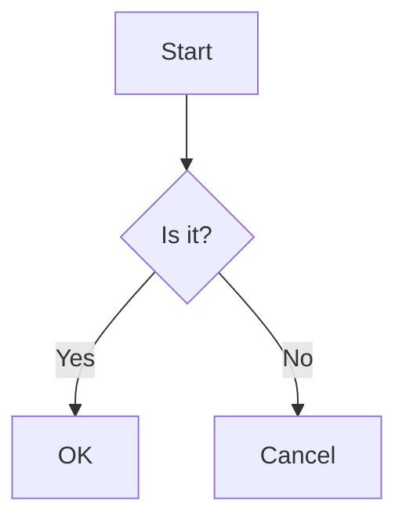

# `@zjlab-frontier/markdown` 使用说明文档

> **包名**：`@zjlab-frontier/markdown`  
> **适用框架**：React（支持 React 18+）  
> **核心引擎**：`react-markdown` + `better-react-mathjax` (MathJax v3) + `mermaid`  
> **功能亮点**：支持 **Mermaid 图表**、**LaTeX 数学公式（MathJax）**、**代码高亮**、**GitHub 风格 Markdown（GFM）**、**长代码折叠**、**一键复制**、**媒体自动识别** 等。

---

## 📦 安装

```bash
npm install @zjlab-frontier/markdown
```

> ⚠️ **前置依赖**：本项目依赖 `react` 和 `react-dom` (≥18.0.0)。

---

## 🚀 快速开始

### 1. 引入组件

```tsx
import { ZJMarkdown } from '@zjlab-frontier/markdown';
```

### 2. 基本使用

```tsx
function App() {
  const markdownContent = `
# 欢迎使用 ZJLab Markdown

这是一个功能强大的 React Markdown 组件。

- ✅ **数学公式**：$E = mc^2$ 或 \[ \sum_{i=1}^n i = \frac{n(n+1)}{2} \]
- ✅ **Mermaid 图表**：流程图、时序图等
- ✅ **代码增强**：自动识别语言、复制按钮、长代码折叠
- ✅ **多媒体**：自动识别 mp3/mp4 链接
  `;

  return (
    <div style={{ padding: 20 }}>
      <ZJMarkdown 
        content={markdownContent} 
        fontSize={16} 
      />
    </div>
  );
}
```

---

## 🧩 功能详解

### 1. **数学公式（MathJax v3）**

组件内置 `better-react-mathjax`，支持强大的 LaTeX 数学公式渲染。

#### ✅ 支持语法：

- **行内公式**：`$...$` 或 `\(...\)`
- **块级公式**：`$$...$$` 或 `\[...\]`
- **环境支持**：支持 `align`, `gather`, `matrix`, `cases` 等常用环境。

#### ⚙️ 预处理增强：

组件内置了 **LaTeX 预处理逻辑**，解决了 Markdown 转义字符（如 `\` 和 `_`）与 LaTeX 语法冲突的问题。

- 自动保护 `\\` 换行符
- 自动处理 `\ce{...}` (化学式) 和 `\boxed{...}`
- 兼容 `\begin{align}...\end{align}` 等环境写法

**示例：**

```latex
爱因斯坦质能方程：$E = mc^2$

高斯积分：
$$
\int_{-\infty}^{\infty} e^{-x^2} dx = \sqrt{\pi} 
$$

矩阵：
\[
\begin{pmatrix}
 a & b \\
c & d
\end{pmatrix}
\]
```

---


### 2. **Mermaid 图表渲染**

在代码块中标注语言为 `mermaid` 即可自动渲染图表。

**示例：**

````markdown

````

---


### 3. **代码块增强**

- **语言标注**：显示语言类型（如 `typescript`）。
- **一键复制**：提供复制按钮。
- **自动折叠**：高度超过 **400px** 自动折叠。
- **自动换行**：对文本类语言（`text`, `md`, `latex`）强制换行。

---


### 4. **GitHub 风格 Markdown (GFM)**

集成 `remark-gfm`，支持表格、任务列表、删除线等。

---


### 5. **媒体自动识别**

- **音频** (`.mp3`, `.wav` 等) → `<audio controls>`
- **视频** (`.mp4`, `.webm` 等) → `<video controls>`

---

## 🎨 样式与自定义

组件根元素默认带有 `.markdown-body` 类。

### Props 属性

| 属性名 | 类型 | 默认值 | 说明 |
|:---|:---|:---|:---|
| `content` | `string` | **必填** | Markdown 源码字符串 |
| `fontSize` | `number` | `16` | 正文字体大小 (px) |
| `fontFamily` | `string` | `'inherit'` | 字体设置 |
| `style` | `CSSProperties` | - | 自定义根元素样式 |

---

## 🛠️ 开发与构建

```bash
npm run build        # 构建产物
npm run build:types  # 生成类型定义
```

---

## 📝 License

MIT