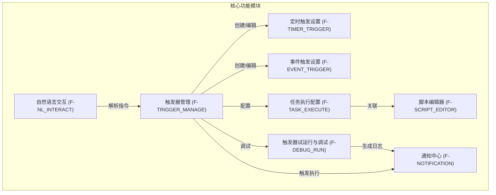
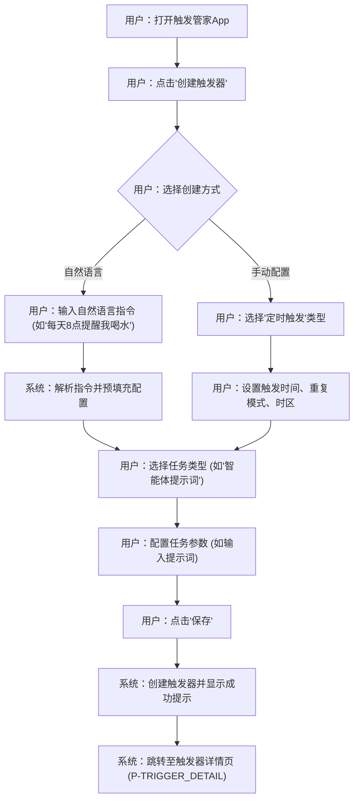
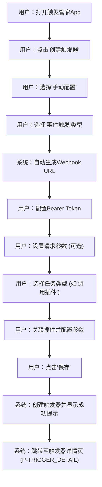
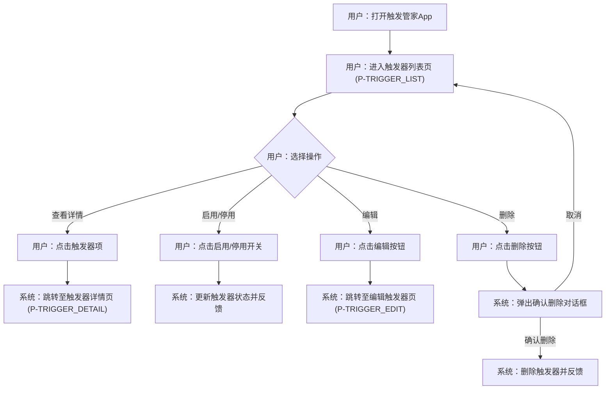
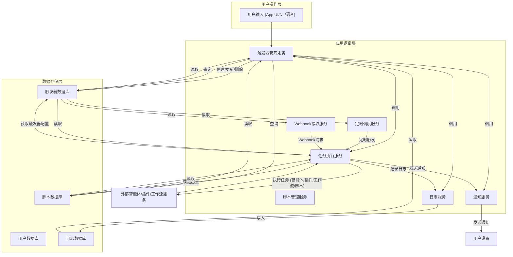
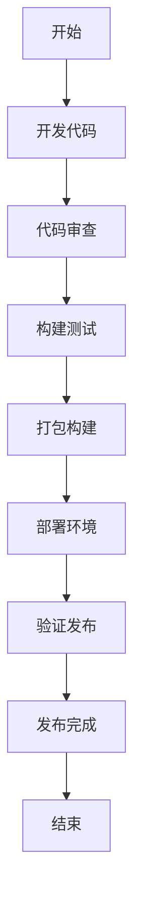

# 触发管家产品需求文档

## 1. 产品概述

### 1.1 产品名称与定位

*   **产品名称:** 触发管家 (Trigger Manager)
*   **产品定位:** 一款专注于智能体触发器管理的移动端应用，旨在通过直观的界面和自然语言交互，帮助用户轻松创建、配置、管理和调试各类定时与事件触发器，实现自动化任务执行。

### 1.2 产品愿景与目标

*   **产品愿景:** 成为智能体自动化领域最便捷、高效的触发器管理工具，赋能用户实现复杂任务的自动化，提升工作与生活效率。
*   **产品目标:**
    *   提供用户友好的界面，降低触发器配置门槛。
    *   支持多种触发方式和任务类型，满足多样化自动化需求。
    *   确保触发器执行的稳定性和可靠性。
    *   提供完善的调试和日志功能，方便用户排查问题。
    *   通过自然语言交互，简化触发器创建流程。

### 1.3 产品使用终端

*   **终端类型:** 移动端App (iOS & Android)

### 1.4 核心价值主张

*   **自动化赋能:** 将复杂的自动化逻辑简化为直观的触发器配置，让用户无需编程即可实现智能体的自动化任务。
*   **高效管理:** 集中管理所有触发器，提供清晰的概览和便捷的操作，提升管理效率。
*   **灵活定制:** 支持定时、事件等多种触发方式，以及智能体提示词、插件、工作流、脚本等多种任务类型，满足个性化需求。
*   **智能交互:** 通过自然语言理解，实现更自然、高效的触发器创建和管理体验。

### 1.5 目标用户群体分析

*   **智能体开发者:** 需要为其开发的智能体配置和管理触发器，以实现自动化响应和任务执行。
*   **企业用户/团队管理员:** 希望通过自动化工具提升团队协作效率，例如定时发送报告、事件驱动的流程审批等。
*   **个人用户:** 追求高效生活，希望通过自动化工具管理日常提醒、信息获取等任务。
*   **技术爱好者:** 对自动化、脚本编程有兴趣，希望探索智能体的更多可能性。

### 1.6 市场需求与竞品简析

*   **市场需求:** 随着智能体技术的普及，用户对智能体自动化的需求日益增长。传统的自动化工具往往操作复杂或功能单一，缺乏针对智能体特性的深度集成。市场需要一款能够简化智能体触发器配置、提供多维度触发和任务执行能力的工具。
*   **竞品简析:**
    *   **通用自动化工具 (如 Zapier, Integromat):** 功能强大但可能过于复杂，且对智能体的集成度不高，缺乏自然语言交互能力。
    *   **智能体平台自带触发器:** 通常功能受限，用户体验不佳，且无法跨平台统一管理。
    *   **脚本/代码自动化:** 门槛高，不适合非技术用户。
*   **触发管家优势:** 专注于智能体触发器，提供移动端便捷操作、自然语言交互、以及与智能体生态的深度集成，填补市场空白。

## 2. 功能规格

### 2.1 功能详述

#### 2.1.1 触发器管理

| 功能ID | 功能名称 | 功能描述 | 优先级 |
|--------|---------|---------|--------|
| F-TRIGGER_MANAGE_001 | 创建触发器 | 用户可以通过自然语言指令或手动配置的方式，创建定时触发或事件触发的触发器。创建过程中需选择触发方式、任务类型及相关参数。 | P0 |
| F-TRIGGER_MANAGE_002 | 查看触发器列表 | 展示所有已创建的触发器，包含触发器名称、类型、状态、下次触发时间（定时）、Webhook URL（事件）等基本信息。支持按类型、状态筛选和搜索。 | P0 |
| F-TRIGGER_MANAGE_003 | 停止/启用触发器 | 用户可以随时暂停或重新激活触发器。停用后，触发器将不再执行任务。 | P0 |
| F-TRIGGER_MANAGE_004 | 编辑触发器 | 用户可以修改现有触发器的所有配置参数，包括名称、触发方式、任务类型、时间/事件设置、任务参数等。 | P0 |
| F-TRIGGER_MANAGE_005 | 删除触发器 | 用户可以从列表中永久删除不再需要的触发器。删除前需二次确认。 | P0 |

#### 2.1.2 定时触发设置

| 功能ID | 功能名称 | 功能描述 | 优先级 |
|--------|---------|---------|--------|
| F-TIMER_TRIGGER_001 | 时间配置 | 用户可以设置触发器的具体触发时间（如每天8:00）、日期（如每月1日）或时间间隔（如每隔2小时）。支持精确到分钟的设置。 | P0 |
| F-TIMER_TRIGGER_002 | 时区适配 | 应用根据用户设备所在时区自动调整触发时间，确保触发器在用户期望的本地时间执行。 | P0 |
| F-TIMER_TRIGGER_003 | 重复设置 | 用户可以配置触发器的重复模式，包括：不重复（一次性）、每天、每周（可选择星期几）、每月（可选择日期）、每年，以及自定义重复周期（如每隔N天/周/月/年）。 | P0 |

#### 2.1.3 事件触发设置

| 功能ID | 功能名称 | 功能描述 | 优先级 |
|--------|---------|---------|--------|
| F-EVENT_TRIGGER_001 | Webhook URL生成 | 当用户创建事件触发器时，系统自动生成一个唯一的Webhook URL。用户可以复制此URL用于外部系统调用。 | P0 |
| F-EVENT_TRIGGER_002 | 安全校验 | 用户可以配置Bearer Token，用于对发送到Webhook URL的请求进行身份验证。系统提供默认Token，用户也可自定义。 | P0 |
| F-EVENT_TRIGGER_003 | 请求参数设置 | 用户可以定义Webhook请求所需的参数名称、类型和默认值。这些参数可在触发器执行时传递给关联的任务（如插件、工作流、脚本）。 | P0 |

#### 2.1.4 任务执行配置

| 功能ID | 功能名称 | 功能描述 | 优先级 |
|--------|---------|---------|--------|
| F-TASK_EXECUTE_001 | 任务类型选择 | 用户在创建或编辑触发器时，必须选择触发器被触发后执行的任务类型。支持：智能体提示词、调用插件、调用工作流、运行脚本。 | P0 |
| F-TASK_EXECUTE_002 | 提示词设置 | 当任务类型为“智能体提示词”时，用户需输入自然语言指令。触发器被触发时，智能体将执行该指令并回复。 | P0 |
| F-TASK_EXECUTE_003 | 插件/工作流关联 | 当任务类型为“调用插件”或“调用工作流”时，用户需从已有的插件或工作流列表中选择一个进行关联。 | P0 |
| F-TASK_EXECUTE_004 | 参数配置 | 当任务类型为“调用插件”、“调用工作流”或“运行脚本”时，用户需为其设置所需的输入参数。参数值可以是固定值，也可以关联Webhook请求参数（事件触发）。 | P0 |

#### 2.1.5 脚本编辑器

| 功能ID | 功能名称 | 功能描述 | 优先级 |
|--------|---------|---------|--------|
| F-SCRIPT_EDITOR_001 | 代码编辑界面 | 提供一个简洁的、支持语法高亮的脚本编辑环境，用户可以在此编写、修改脚本代码。 | P0 |
| F-SCRIPT_EDITOR_002 | 脚本保存与管理 | 用户可以保存多个脚本，并对脚本进行命名、分类管理（如创建文件夹）。 | P0 |
| F-SCRIPT_EDITOR_003 | 脚本测试运行 | 用户在编辑脚本后，可以立即进行测试运行，查看脚本输出结果，以便调试。 | P0 |
| F-SCRIPT_EDITOR_004 | 脚本参数设置 | 用户可以为脚本定义输入参数，这些参数可在脚本运行时传递。 | P0 |
| F-SCRIPT_EDITOR_005 | 定时运行绑定 | 用户可以将已保存的脚本与定时触发器关联，实现脚本的自动执行。 | P0 |

#### 2.1.6 自然语言交互

| 功能ID | 功能名称 | 功能描述 | 优先级 |
|--------|---------|---------|--------|
| F-NL_INTERACT_001 | 指令解析 | 应用能够理解用户输入的自然语言指令，并将其转化为对应的触发器配置。例如，“每天早上8点提醒我喝水”将被解析为一个定时触发器。 | P0 |
| F-NL_INTERACT_002 | 语音输入 | 用户可以通过语音方式输入创建或管理触发器的指令，系统将语音转换为文本并进行解析。 | P0 |
| F-NL_INTERACT_003 | 智能建议 | 根据用户的输入习惯和历史配置，系统提供触发器配置建议，例如推荐常用的触发时间、任务类型等。 | P0 |

#### 2.1.7 触发器试运行与调试

| 功能ID | 功能名称 | 功能描述 | 优先级 |
|--------|---------|---------|--------|
| F-DEBUG_RUN_001 | 试运行功能 | 用户可以在不等待实际触发条件的情况下，手动试运行触发器，以验证其配置是否正确，任务是否能正常执行。 | P0 |
| F-DEBUG_RUN_002 | 执行日志 | 记录所有触发器的执行历史，包括触发时间、任务类型、执行状态（成功/失败）、返回结果或错误信息。用户可以按触发器、时间范围等条件查询日志。 | P0 |
| F-DEBUG_RUN_003 | 错误提示 | 当触发器执行失败时，系统提供明确的错误信息和可能的解决方案，帮助用户快速定位并解决问题。 | P0 |

#### 2.1.8 通知中心

| 功能ID | 功能名称 | 功能描述 | 优先级 |
|--------|---------|---------|--------|
| F-NOTIFICATION_001 | 触发提醒 | 当触发器被触发并开始执行任务时，向用户发送通知。 | P0 |
| F-NOTIFICATION_002 | 执行结果推送 | 将任务执行的结果（如智能体回复、插件返回信息、脚本输出）推送给用户。 | P0 |
| F-NOTIFICATION_003 | 异常警报 | 当触发器出现异常（如配置错误、执行超时）或执行失败时，立即向用户发送提醒。 | P0 |

### 2.2 功能模块间的关系图

## 3. 用户流程

### 3.1 用户旅程地图

| 阶段 | 用户目标 | 用户行为 | 系统响应 | 痛点/机遇 |
|------|----------|----------|----------|-----------|
| **发现与兴趣** | 了解产品功能 | 浏览应用商店、阅读介绍 | 展示产品核心价值和优势 | 自动化工具复杂，用户渴望简单易用的解决方案 |
| **首次使用** | 快速上手 | 下载安装、注册登录、浏览引导页 | 提供清晰的引导，展示核心功能入口 | 担心配置复杂，需要直观的入门体验 |
| **创建触发器** | 实现自动化任务 | 选择创建方式（自然语言/手动）、配置触发条件、选择任务类型、设置参数 | 实时解析指令、提供配置选项、生成Webhook URL | 配置项多，容易出错；希望快速完成配置 |
| **管理触发器** | 查看和调整现有触发器 | 进入触发器列表、筛选/搜索、启用/停用、编辑、删除 | 展示触发器状态、提供操作入口、执行用户指令 | 触发器数量多，难以管理；需要快速定位特定触发器 |
| **调试与优化** | 确保触发器正常工作 | 试运行触发器、查看执行日志、根据错误提示调整 | 执行任务、记录日志、提供错误详情 | 触发器不按预期执行，难以排查问题 |
| **接收结果** | 获取自动化任务反馈 | 接收通知、查看执行结果 | 发送通知、展示任务输出 | 无法及时了解任务执行情况；结果不直观 |

### 3.2 关键路径流程图

#### 3.2.1 创建定时触发器流程

#### 3.2.2 创建事件触发器流程

#### 3.2.3 管理触发器流程

### 3.3 各场景下的用户操作步骤

#### 3.3.1 场景：创建一个每天早上8点发送天气提醒的定时触发器

1.  **用户操作:** 打开触发管家App。
2.  **用户操作:** 点击底部导航栏的“+”或“创建触发器”按钮。
3.  **用户操作:** 在创建方式选择界面，选择“自然语言”。
4.  **用户操作:** 输入指令“每天早上8点提醒我北京天气”。
5.  **系统响应:** 解析指令，预填充触发器名称为“每天早上8点提醒我北京天气”，触发类型为“定时触发”，时间为“每天 08:00”，任务类型为“智能体提示词”，提示词为“提醒我北京天气”。
6.  **用户操作:** 确认预填充信息无误后，点击“保存”按钮。
7.  **系统响应:** 显示“触发器创建成功”提示，并自动跳转至该触发器的详情页（P-TRIGGER_DETAIL）。

#### 3.3.2 场景：创建一个接收Webhook请求并调用工作流的事件触发器

1.  **用户操作:** 打开触发管家App。
2.  **用户操作:** 点击底部导航栏的“+”或“创建触发器”按钮。
3.  **用户操作:** 在创建方式选择界面，选择“手动配置”。
4.  **用户操作:** 在触发器类型选择界面，选择“事件触发”。
5.  **系统响应:** 自动生成Webhook URL并显示，同时显示默认的Bearer Token。
6.  **用户操作:** （可选）修改Bearer Token。
7.  **用户操作:** （可选）点击“添加参数”，输入参数名称“orderId”，类型“字符串”。
8.  **用户操作:** 在任务类型选择界面，选择“调用工作流”。
9.  **用户操作:** 从工作流列表中选择“订单处理工作流”。
10. **用户操作:** 配置工作流参数，将“订单ID”参数的值设置为“{{orderId}}”（关联Webhook请求参数）。
11. **用户操作:** 点击“保存”按钮。
12. **系统响应:** 显示“触发器创建成功”提示，并自动跳转至该触发器的详情页（P-TRIGGER_DETAIL）。

#### 3.3.3 场景：编辑一个已有的定时触发器

1.  **用户操作:** 打开触发管家App。
2.  **用户操作:** 进入触发器列表页（P-TRIGGER_LIST）。
3.  **用户操作:** 找到需要编辑的触发器，点击其右侧的“编辑”图标或进入详情页后点击“编辑”按钮。
4.  **系统响应:** 跳转至编辑触发器页（P-TRIGGER_EDIT），并加载当前触发器的所有配置。
5.  **用户操作:** 修改触发时间为“每天 09:00”，并将任务类型从“智能体提示词”改为“调用插件”，选择“天气插件”并配置参数。
6.  **用户操作:** 点击“保存”按钮。
7.  **系统响应:** 显示“触发器更新成功”提示，并自动跳转回该触发器的详情页（P-TRIGGER_DETAIL）。

## 4. 数据流设计

### 4.1 数据结构与关系

*   **用户 (User):**
    *   `userId` (主键)
    *   `username`
    *   `email`
    *   `passwordHash`
    *   `timezone` (用户时区)
*   **触发器 (Trigger):**
    *   `triggerId` (主键)
    *   `userId` (外键，关联用户)
    *   `name` (触发器名称)
    *   `type` (触发类型：'TIMER', 'EVENT')
    *   `status` (状态：'ACTIVE', 'INACTIVE')
    *   `createTime`
    *   `updateTime`
    *   `nextFireTime` (下次触发时间，仅定时)
    *   `lastFireTime` (上次触发时间)
    *   `triggerConfig` (JSONB，存储定时或事件的具体配置)
    *   `taskConfig` (JSONB，存储任务执行的具体配置)
*   **定时触发配置 (TimerTriggerConfig):** (存储在Trigger.triggerConfig中)
    *   `time` (具体时间，如 '08:00')
    *   `repeatMode` (重复模式：'ONCE', 'DAILY', 'WEEKLY', 'MONTHLY', 'YEARLY', 'CUSTOM')
    *   `repeatInterval` (重复间隔，如 1 天)
    *   `weekDays` (星期几，数组，仅周重复)
    *   `monthDays` (日期，数组，仅月重复)
    *   `timezone` (时区)
*   **事件触发配置 (EventTriggerConfig):** (存储在Trigger.triggerConfig中)
    *   `webhookUrl` (Webhook URL)
    *   `bearerToken` (Bearer Token)
    *   `requestParams` (JSONB，请求参数定义，如 `[{"name": "param1", "type": "string"}]`)
*   **任务配置 (TaskConfig):** (存储在Trigger.taskConfig中)
    *   `type` (任务类型：'AGENT_PROMPT', 'PLUGIN_CALL', 'WORKFLOW_CALL', 'SCRIPT_RUN')
    *   `content` (提示词内容，仅AGENT_PROMPT)
    *   `targetId` (插件ID、工作流ID或脚本ID)
    *   `parameters` (JSONB，任务输入参数，如 `[{"name": "param1", "value": "fixedValue"}]` 或 `[{"name": "param1", "value": "{{webhookParam}}"}]`)
*   **脚本 (Script):**
    *   `scriptId` (主键)
    *   `userId` (外键，关联用户)
    *   `name` (脚本名称)
    *   `code` (脚本代码)
    *   `parameters` (JSONB，脚本参数定义)
    *   `createTime`
    *   `updateTime`
*   **执行日志 (ExecutionLog):**
    *   `logId` (主键)
    *   `triggerId` (外键，关联触发器)
    *   `fireTime` (触发时间)
    *   `status` (执行状态：'SUCCESS', 'FAILED', 'RUNNING')
    *   `result` (JSONB，任务执行结果)
    *   `errorMessage` (错误信息，仅FAILED)
    *   `duration` (执行时长)

### 4.2 关键数据流向图

### 4.3 数据存储与处理原则

1.  **数据安全性:**
    *   所有敏感数据（如Bearer Token）进行加密存储。
    *   用户密码采用加盐哈希存储。
    *   Webhook请求进行严格的身份验证和授权。
    *   数据传输采用HTTPS加密。
2.  **数据一致性:**
    *   触发器状态、下次触发时间等关键数据保持强一致性。
    *   采用事务管理确保数据操作的原子性。
3.  **数据可靠性:**
    *   定期数据备份与恢复机制。
    *   高可用架构，确保服务和数据不中断。
4.  **数据可追溯性:**
    *   详细记录所有触发器的执行日志，包括成功、失败及错误信息，便于问题排查和审计。
5.  **数据扩展性:**
    *   数据库设计考虑未来功能扩展，采用灵活的JSONB字段存储动态配置。
    *   支持水平扩展以应对用户量和数据量的增长。
6.  **数据隐私:**
    *   严格遵守用户数据隐私保护法规，未经用户授权不共享任何数据。

## 5. 页面规格

### 5.1 页面概览

| 页面ID | 页面名称 | 核心功能 |
|--------|---------|---------|
| P-HOME | 首页 | 快速入口、概览、自然语言输入 |
| P-TRIGGER_LIST | 触发器列表页 | 展示、管理所有触发器 |
| P-TRIGGER_CREATE | 创建触发器页 | 选择创建方式、配置触发器基本信息 |
| P-TRIGGER_EDIT | 编辑触发器页 | 修改触发器配置 |
| P-TRIGGER_DETAIL | 触发器详情页 | 查看触发器详细信息、执行操作 |
| P-TIMER_CONFIG | 定时触发配置页 | 设置定时触发的时间、重复、时区 |
| P-EVENT_CONFIG | 事件触发配置页 | 设置Webhook URL、Token、请求参数 |
| P-TASK_CONFIG | 任务执行配置页 | 选择任务类型、配置任务参数 |
| P-SCRIPT_LIST | 脚本列表页 | 展示、管理所有脚本 |
| P-SCRIPT_EDITOR | 脚本编辑器页 | 编写、测试、保存脚本 |
| P-LOG_LIST | 执行日志页 | 查看触发器执行历史和结果 |
| P-NOTIFICATION_CENTER | 通知中心页 | 接收触发器执行通知、结果、警报 |
| P-SETTINGS | 设置页 | 应用通用设置、个人信息 |
| P-ABOUT | 关于我们页 | 应用版本、隐私政策、用户协议 |

### 5.2 页面详情

#### 5.2.1 首页（P-HOME）

*   **页面名称与目的:** 首页，作为应用的入口，提供快速创建触发器、查看概览信息和自然语言交互的功能。
*   **页面负责的核心功能:**
    *   提供自然语言输入框，用于快速创建触发器。
    *   展示触发器概览（如活跃触发器数量、今日待执行任务数）。
    *   提供核心功能的快捷入口（如创建触发器、查看列表）。
*   **主要UI元素与布局建议:**
    *   顶部：应用名称/Logo，通知中心入口（图标）。
    *   中部：自然语言输入框，带有语音输入按钮。
    *   下方：触发器概览卡片（可点击进入列表），快捷功能入口（如“创建触发器”按钮）。
    *   底部导航栏：首页、触发器、脚本、设置。
*   **页面需展示的关键数据:**
    *   活跃触发器数量。
    *   今日待执行任务数量。
    *   最近执行的触发器状态。

#### 5.2.2 触发器列表页（P-TRIGGER_LIST）

*   **页面名称与目的:** 触发器列表页，集中展示用户所有已创建的触发器，并提供管理入口。
*   **页面负责的核心功能:**
    *   展示触发器列表，包含名称、类型、状态、下次触发时间/URL等。
    *   支持按类型、状态筛选和搜索。
    *   提供启用/停用、编辑、删除触发器的快捷操作。
*   **主要UI元素与布局建议:**
    *   顶部：页面标题“触发器”，搜索框，筛选按钮。
    *   中部：触发器列表，每项包含名称、类型图标、状态开关、下次触发时间/URL片段、编辑/删除图标。
    *   底部：浮动“+”按钮，用于快速创建触发器。
    *   底部导航栏：首页、触发器、脚本、设置。
*   **页面需展示的关键数据:**
    *   触发器名称。
    *   触发器类型（定时/事件）。
    *   触发器状态（启用/停用）。
    *   下次触发时间（定时）。
    *   Webhook URL（事件）。
    *   上次触发时间。

#### 5.2.3 创建触发器页（P-TRIGGER_CREATE）

*   **页面名称与目的:** 创建触发器页，引导用户选择创建方式并进行初步配置。
*   **页面负责的核心功能:**
    *   提供自然语言输入和手动配置两种创建方式。
    *   根据选择的方式，引导用户进入相应的配置流程。
*   **主要UI元素与布局建议:**
    *   顶部：页面标题“创建触发器”，返回按钮。
    *   中部：
        *   “自然语言创建”区域：包含输入框和语音输入按钮。
        *   “手动配置”区域：包含“定时触发”和“事件触发”两个按钮。
    *   底部：（根据选择的方式动态显示）下一步/保存按钮。
*   **页面需展示的关键数据:**
    *   无特定数据展示，主要为用户输入和选择。

#### 5.2.4 编辑触发器页（P-TRIGGER_EDIT）

*   **页面名称与目的:** 编辑触发器页，允许用户修改现有触发器的所有配置参数。
*   **页面负责的核心功能:**
    *   加载并显示当前触发器的所有配置。
    *   允许用户修改触发器名称、触发方式、任务类型及相关参数。
    *   保存修改后的配置。
*   **主要UI元素与布局建议:**
    *   顶部：页面标题“编辑触发器”，返回按钮，保存按钮。
    *   中部：
        *   触发器名称输入框。
        *   触发类型选择（定时/事件），根据选择显示对应配置区域。
        *   任务类型选择（智能体提示词/插件/工作流/脚本），根据选择显示对应配置区域。
    *   底部：（根据配置动态显示）下一步/保存按钮。
*   **页面需展示的关键数据:**
    *   当前触发器的名称、类型、状态、触发配置、任务配置。

#### 5.2.5 触发器详情页（P-TRIGGER_DETAIL）

*   **页面名称与目的:** 触发器详情页，展示单个触发器的详细配置信息，并提供相关操作入口。
*   **页面负责的核心功能:**
    *   展示触发器的所有详细配置（名称、类型、状态、触发时间/URL、任务类型、参数等）。
    *   提供启用/停用、编辑、删除、试运行触发器的操作。
    *   显示最近的执行日志。
*   **主要UI元素与布局建议:**
    *   顶部：页面标题（触发器名称），返回按钮，编辑按钮。
    *   中部：
        *   触发器基本信息（名称、类型、状态开关）。
        *   触发配置详情（定时：时间、重复、时区；事件：Webhook URL、Token、请求参数）。
        *   任务配置详情（任务类型、提示词/插件/工作流/脚本名称、参数）。
        *   最近执行日志列表（可点击查看详情）。
    *   底部：操作按钮（试运行、删除）。
*   **页面需展示的关键数据:**
    *   触发器的完整配置信息。
    *   最近几次的执行日志（触发时间、状态、结果摘要）。

#### 5.2.6 定时触发配置页（P-TIMER_CONFIG）

*   **页面名称与目的:** 定时触发配置页，用于设置定时触发器的时间、重复模式和时区。
*   **页面负责的核心功能:**
    *   设置具体触发时间。
    *   配置重复模式（一次性、每天、每周、每月、每年、自定义）。
    *   显示并允许修改时区。
*   **主要UI元素与布局建议:**
    *   顶部：页面标题“定时触发配置”，返回按钮，下一步/保存按钮。
    *   中部：
        *   时间选择器（小时、分钟）。
        *   重复模式选择器（单选按钮或下拉菜单）。
        *   根据重复模式显示额外选项（如星期选择、日期选择、间隔输入）。
        *   时区显示（自动获取，可手动修改）。
*   **页面需展示的关键数据:**
    *   当前设置的时间、重复模式、时区。

#### 5.2.7 事件触发配置页（P-EVENT_CONFIG）

*   **页面名称与目的:** 事件触发配置页，用于设置事件触发器的Webhook URL、安全Token和请求参数。
*   **页面负责的核心功能:**
    *   显示自动生成的Webhook URL。
    *   配置Bearer Token。
    *   定义Webhook请求参数。
*   **主要UI元素与布局建议:**
    *   顶部：页面标题“事件触发配置”，返回按钮，下一步/保存按钮。
    *   中部：
        *   Webhook URL显示框，带有复制按钮。
        *   Bearer Token输入框，带有生成/刷新按钮。
        *   请求参数列表，带有“添加参数”按钮。每个参数项包含名称、类型输入框。
*   **页面需展示的关键数据:**
    *   自动生成的Webhook URL。
    *   当前设置的Bearer Token。
    *   已定义的请求参数列表。

#### 5.2.8 任务执行配置页（P-TASK_CONFIG）

*   **页面名称与目的:** 任务执行配置页，用于选择触发器被触发后执行的任务类型并进行相应配置。
*   **页面负责的核心功能:**
    *   选择任务类型（智能体提示词、调用插件、调用工作流、运行脚本）。
    *   根据任务类型，配置相应的参数（提示词、插件/工作流/脚本选择、参数设置）。
*   **主要UI元素与布局建议:**
    *   顶部：页面标题“任务执行配置”，返回按钮，保存按钮。
    *   中部：
        *   任务类型选择器（单选按钮或下拉菜单）。
        *   根据任务类型显示对应配置区域：
            *   **智能体提示词:** 多行文本输入框。
            *   **调用插件/工作流/脚本:** 选择器（弹出列表），参数列表（可添加、编辑参数名和值）。
*   **页面需展示的关键数据:**
    *   当前选择的任务类型。
    *   对应任务类型的配置参数。

#### 5.2.9 脚本列表页（P-SCRIPT_LIST）

*   **页面名称与目的:** 脚本列表页，集中展示用户所有已创建的脚本，并提供管理入口。
*   **页面负责的核心功能:**
    *   展示脚本列表，包含名称、创建时间、最后修改时间。
    *   提供创建、编辑、删除脚本的快捷操作。
*   **主要UI元素与布局建议:**
    *   顶部：页面标题“脚本”，搜索框。
    *   中部：脚本列表，每项包含名称、创建时间、最后修改时间、编辑/删除图标。
    *   底部：浮动“+”按钮，用于快速创建脚本。
    *   底部导航栏：首页、触发器、脚本、设置。
*   **页面需展示的关键数据:**
    *   脚本名称。
    *   创建时间。
    *   最后修改时间。

#### 5.2.10 脚本编辑器页（P-SCRIPT_EDITOR）

*   **页面名称与目的:** 脚本编辑器页，提供一个简洁的环境供用户编写、测试和保存脚本。
*   **页面负责的核心功能:**
    *   提供代码编辑区域，支持语法高亮。
    *   允许用户输入脚本名称。
    *   提供脚本测试运行功能。
    *   允许用户定义脚本参数。
    *   保存脚本。
*   **主要UI元素与布局建议:**
    *   顶部：页面标题（“新建脚本”或脚本名称），返回按钮，保存按钮。
    *   中部：
        *   脚本名称输入框。
        *   代码编辑区域（多行文本框，支持语法高亮）。
        *   脚本参数列表（可添加、编辑参数名和类型）。
        *   测试运行按钮。
        *   测试结果显示区域。
*   **页面需展示的关键数据:**
    *   当前脚本的名称、代码、参数定义。
    *   测试运行的输出结果或错误信息。

#### 5.2.11 执行日志页（P-LOG_LIST）

*   **页面名称与目的:** 执行日志页，展示所有触发器的执行历史和结果，方便用户查看和调试。
*   **页面负责的核心功能:**
    *   展示触发器的执行日志列表。
    *   支持按触发器、时间范围、执行状态筛选和搜索。
    *   显示每条日志的详细信息（触发时间、状态、结果、错误信息）。
*   **主要UI元素与布局建议:**
    *   顶部：页面标题“执行日志”，返回按钮，筛选/搜索按钮。
    *   中部：日志列表，每项包含触发器名称、触发时间、执行状态（成功/失败）、结果摘要。
    *   点击列表项可展开查看详细日志信息。
*   **页面需展示的关键数据:**
    *   触发器名称。
    *   触发时间。
    *   执行状态。
    *   任务执行结果（摘要）。
    *   错误信息（如果失败）。

#### 5.2.12 通知中心页（P-NOTIFICATION_CENTER）

*   **页面名称与目的:** 通知中心页，集中展示触发器执行的提醒、结果和异常警报。
*   **页面负责的核心功能:**
    *   展示所有通知列表。
    *   支持按通知类型（提醒、结果、警报）筛选。
    *   显示每条通知的详细信息。
*   **主要UI元素与布局建议:**
    *   顶部：页面标题“通知中心”，返回按钮，筛选按钮。
    *   中部：通知列表，每项包含通知类型图标、标题、内容摘要、时间。
    *   点击列表项可查看通知详情。
*   **页面需展示的关键数据:**
    *   通知类型。
    *   通知标题。
    *   通知内容。
    *   通知时间。

#### 5.2.13 设置页（P-SETTINGS）

*   **页面名称与目的:** 设置页，提供应用通用设置和个人信息管理。
*   **页面负责的核心功能:**
    *   提供个人信息查看与修改。
    *   提供通知设置。
    *   提供执行日志入口。
    *   提供关于我们入口。
*   **主要UI元素与布局建议:**
    *   顶部：页面标题“设置”，返回按钮。
    *   中部：列表项，包括：
        *   个人信息（点击进入个人信息编辑）。
        *   通知设置（开关或点击进入详情）。
        *   执行日志（点击进入执行日志页）。
        *   关于我们（点击进入关于我们页）。
    *   底部导航栏：首页、触发器、脚本、设置。
*   **页面需展示的关键数据:**
    *   用户头像、昵称。
    *   通知开关状态。

#### 5.2.14 关于我们页（P-ABOUT）

*   **页面名称与目的:** 关于我们页，展示应用的版本信息、隐私政策和用户协议。
*   **页面负责的核心功能:**
    *   显示应用版本号。
    *   提供隐私政策和用户协议的链接。
*   **主要UI元素与布局建议:**
    *   顶部：页面标题“关于我们”，返回按钮。
    *   中部：应用Logo，应用名称，版本号，隐私政策链接，用户协议链接。
*   **页面需展示的关键数据:**
    *   应用版本号。

好的，为您创建一个关于代码发布的 Mermaid 流程图。以下是图表的定义：

### 流程图说明：
1. **开始**：启动发布流程
2. **开发代码**：编写和修改代码
3. **代码审查**：进行代码质量和安全检查
4. **构建测试**：编译代码并运行单元测试
5. **打包构建**：生成可发布的软件包
6. **部署环境**：将构建好的包部署到目标环境
7. **验证发布**：进行功能和性能测试验证
8. **发布完成**：确认发布成功
9. **结束**：流程结束

您可以在 Mermaid Live Editor（https://mermaid.live/）或任何支持 Mermaid 语法的工具中直接使用这段代码生成流程图。只需将代码粘贴到编辑器中并渲染即可。

ANSWER: 代码发布 Mermaid 流程图定义已提供。完整代码为：
